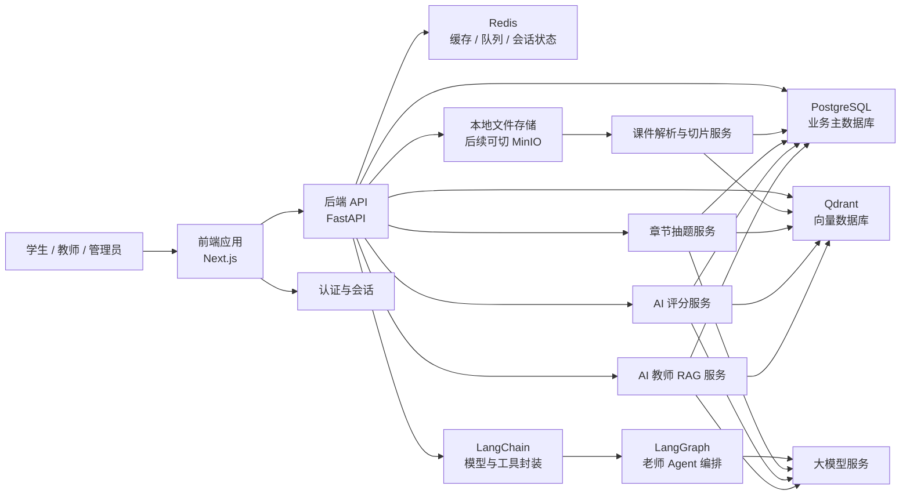
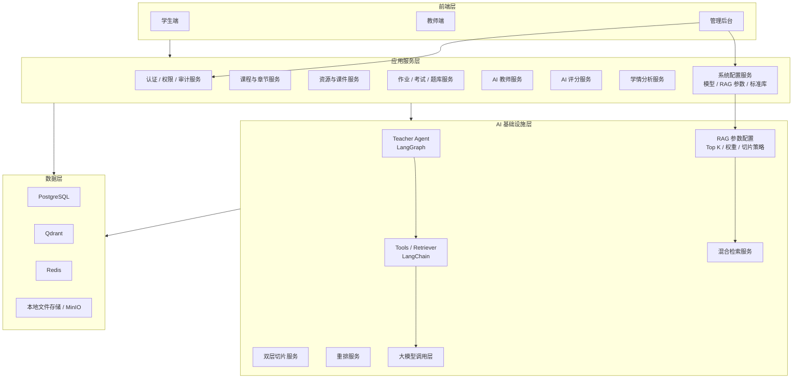
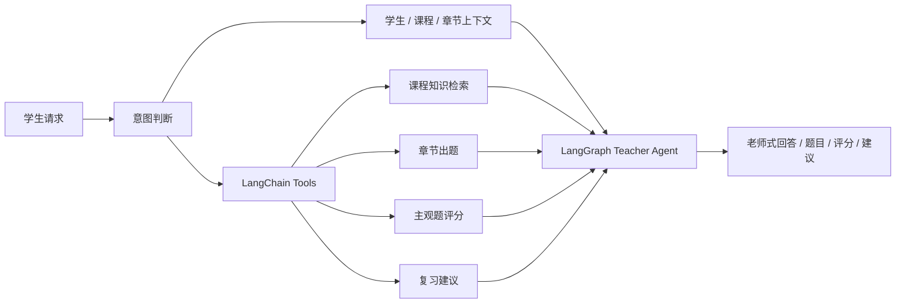
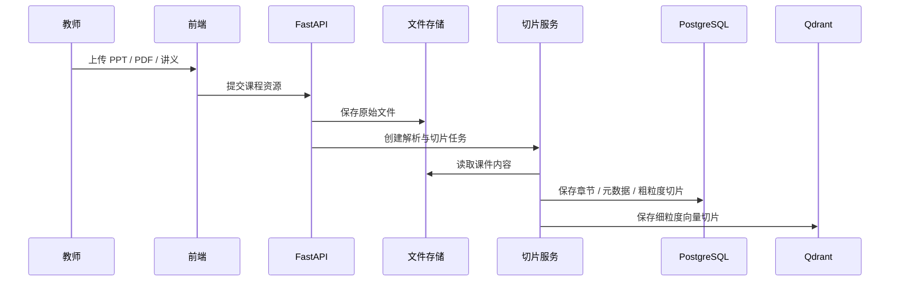
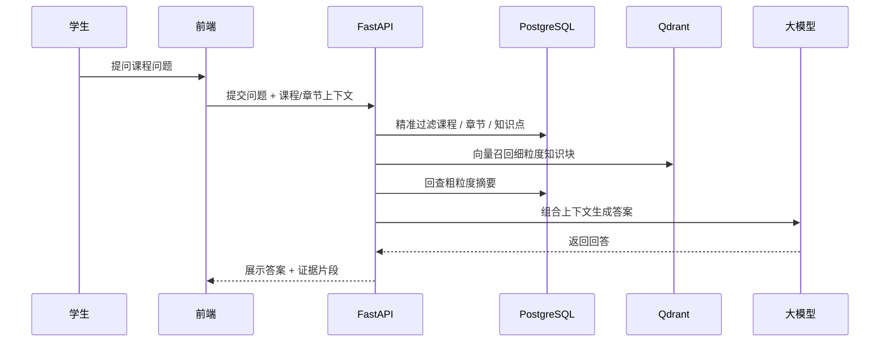
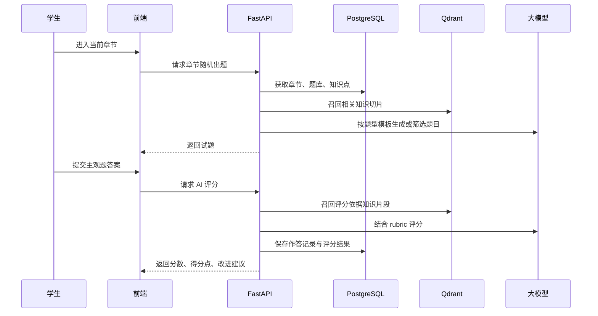

# System Architecture

## 总体架构图

## 模块分层图

## 管理员端职责

- 账号与权限：维护学生、教师、管理员角色，并按课程、班级、功能点绑定可操作范围。
- RAG 数据库调节：管理课程知识库集合、Top K、精准检索权重、向量检索权重、重排序策略、切片大小和切片重叠。
- 模型配置：区分 `LLM` 和 `Embedding` 配置，避免聊天模型与向量化模型混用。
- 标准资源库：维护 IEC 60617 元件映射、本地元件库版本、线材和接口接茬配置。
- 系统审计：记录用户、时间、操作对象、旧值、新值和回滚版本，尤其是重建向量库和切换模型等高风险操作。

## AI 老师 Agent 架构

## 关键数据流

### 1. 课件上传与入库

### 2. AI 教师问答

### 3. 当前章节随机出题与 AI 评分

## 当前 Demo 对应范围

- 前端原型：`/demo`
- 后端骨架：`/backend/app`
- RAG 设计说明：`/docs/rag-design.md`
- API 清单：`/docs/api-overview.md`
- 老师 Agent 设计：`/docs/teacher-agent.md`
- 对外展示说明：`/docs/solution-summary.md`

## 设计原则

- 业务数据和向量数据分开管理：`PostgreSQL + Qdrant`
- 文件存储先本地目录，后续平滑升级 `MinIO`
- AI 能力不直接裸调用模型，而是走 `RAG + 规则 + 模型` 组合策略
- 双层切片同时服务问答、出题、评分三条主线
- 三端入口通过登录身份认证分流，正式版建议采用 `RBAC` 权限模型
