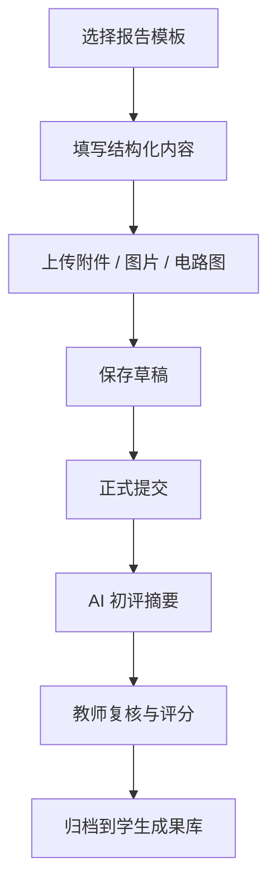

# Engineering Report Module Design

## 功能定位

工程报告提交模块面向项目化、工程化课程，支持学生提交：

- 技术备忘录
- 巡检记录表
- 故障诊断单
- 运维方案
- 实验报告
- 个人工程履历

该模块的目标不是普通附件上传，而是：

`结构化工程成果提交 + 可追溯记录 + AI 辅助评阅`

## 对应样章需求

从当前样章看，课程成果物具有以下特点：

- 需要按任务输出阶段性成果
- 需要包含参数计算、设计依据、工况分析
- 需要包含表格、记录单、排查流程
- 需要支持个人总结与工程履历沉淀

因此，系统应支持：

- 模板化提交
- 结构化字段填写
- 文档附件上传
- AI 生成初步评阅意见
- 教师二次复核

## 典型报告类型

### 1. 技术备忘录

适合提交：

- 电路设计说明
- 参数选型说明
- 工况优化结论

建议字段：

- 项目背景
- 设计目标
- 参数计算
- 元器件选型
- 工况分析
- 风险与建议

### 2. 巡检记录表

适合提交：

- 日常巡检
- 周检记录
- 故障排查记录

建议字段：

- 设备编号
- 巡检时间
- 巡检项目
- 测量值
- 合格判定
- 异常说明

### 3. 运维方案

适合提交：

- 预防性维护计划
- 故障定位流程
- 备件更换建议

### 4. 个人工程履历

适合提交：

- 模块成果归档
- 项目总结
- 求职展示材料

## 模块结构



## 页面组成建议

### 学生端

- 报告模板选择
- 报告标题与任务归属
- 结构化内容编辑区
- 附件上传区
- 自动保存草稿
- 提交状态

### 教师端

- 报告列表
- 按任务 / 学生 / 章节筛选
- AI 初评摘要
- 教师评分与评语
- 导出归档

## 提交数据建议

### 主表

- `id`
- `course_id`
- `chapter_id`
- `task_id`
- `student_id`
- `report_type`
- `title`
- `status`
- `submitted_at`

### 内容表

- `report_id`
- `structured_content_json`
- `plain_text_content`
- `ai_summary`
- `teacher_feedback`
- `score`

### 附件表

- `report_id`
- `file_type`
- `file_url`
- `original_name`

## 结构化内容建议

以技术备忘录为例：

```json
{
  "project_context": "PLC 控制柜 LED 指示灯频繁故障",
  "design_target": "寿命 >= 50000h，年故障率 <= 1%",
  "calculation": "根据 5V 电源与 LED 正向压降计算限流电阻",
  "component_selection": "选用 330Ω 1/2W 电阻",
  "risk_analysis": "高温工况下需考虑功率降额",
  "conclusion": "建议采用工业降额设计并建立巡检机制"
}
```

## AI 辅助能力

该模块适合接入以下 AI 能力：

- 检查报告结构是否完整
- 检查是否缺少关键参数
- 根据课程知识库判断术语是否规范
- 对反思类内容生成初步总结
- 为教师生成“初评摘要”

## 与现有系统的关系

该模块与现有功能联动方式如下：

- 与章节学习关联：报告绑定具体章节或任务
- 与电路图功能关联：可把电路图作为附件或嵌入成果
- 与 Teacher Agent 关联：AI 辅助审阅与总结
- 与学生画像关联：报告表现进入学习报告

## 当前 Demo 设计策略

当前 demo 优先展示：

- 模板选择
- 技术备忘录填写
- 附件占位说明
- 提交状态
- AI 初评摘要预览

这样足够支撑学校理解模块方向。

## 正式版扩展方向

- 富文本或 Markdown 编辑器
- 结构化表单模板引擎
- PDF 导出
- 版本记录
- 教师批注
- 学生成果档案库
