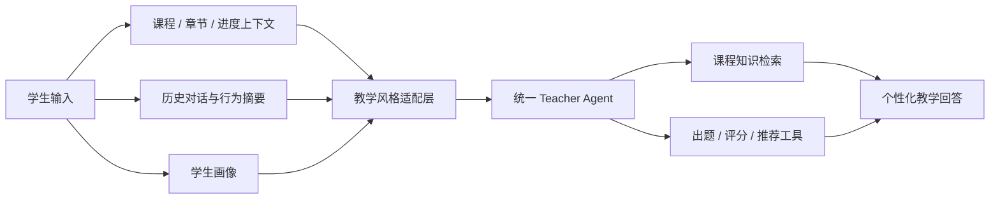
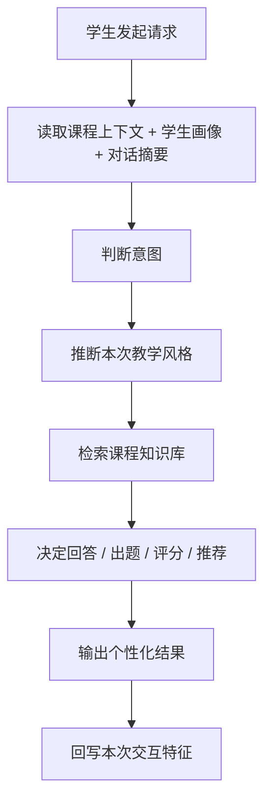

# Personalized Teacher Agent Design

## 设计目标

本系统中的 AI 老师，不只是一名统一的课程老师，还需要具备：

`面向不同学生进行个性化教学适配`

也就是说，老师 Agent 面对不同学生时，应根据其学习习惯、提问方式、作答表现和历史对话，动态调整讲解方式、回答风格和练习策略。

## 核心原则

### 1. 老师身份统一

所有学生面对的，都是同一门课程下的同一个老师 Agent。

统一部分包括：

- 课程知识边界
- 教学原则
- 评分标准
- 专业术语规范
- 教师身份和整体语气

### 2. 教学风格个性化

允许针对不同学生动态变化：

- 回答长短
- 解释深度
- 举例风格
- 引导方式
- 鼓励方式
- 出题难度
- 推荐节奏

因此本设计不是“每个学生一个完全不同人格”，而是：

`统一老师人格 + 个性化教学风格适配`

## 适配来源

老师 Agent 的个性化调整，主要依据以下信息：

- 学生首次登录基础问卷
- 学生当前课程与章节进度
- 学生作业与测验结果
- 学生错题分布
- 学生提问方式与表达习惯
- 学生与 AI 老师的历史对话摘要
- 学生对不同解释方式的反馈效果

## 个性化维度

### 1. 解释风格

- `concise`：简洁结论型
- `detailed`：详细展开型
- `stepwise`：分步骤讲解型
- `concept-first`：先概念后应用
- `example-first`：先例子后归纳

### 2. 语气风格

- `encouraging`：鼓励型
- `rigorous`：严谨型
- `guided`：启发型
- `calm`：平稳陪伴型

### 3. 举例偏好

- 生活类例子
- 专业实验类例子
- 电路图或结构图类例子
- 公式与推导类例子

### 4. 练习策略

- 保守巩固型
- 平衡提升型
- 进阶挑战型

## 个性化 Teacher Agent 架构

## 学生画像设计

建议为每个学生维护一份画像。

## 初始画像生成

首次登录时，不建议直接生成过强的结论性标签，而应通过一份基础问卷生成：

- 年龄
- 当前年级 / 学段
- 实操经验
- 基础水平的模糊分层
- 偏好的讲解方式
- 练习难度倾向
- 当前最关注的学习目标

然后在后续学习过程中，结合：

- AI 对话
- 章节作答
- 工程报告
- 电路图表现

持续修正这份画像。

### 基础字段

- `student_id`
- `course_id`
- `current_chapter_id`
- `current_progress`
- `last_active_at`

### 能力相关字段

- `mastery_level`
- `weak_knowledge_points`
- `preferred_difficulty`
- `error_patterns`

### 风格相关字段

- `preferred_explanation_style`
- `preferred_tone_style`
- `preferred_example_style`
- `response_length_preference`

### 行为相关字段

- `question_frequency`
- `retry_behavior`
- `help_seeking_pattern`
- `conversation_engagement_score`

## 对话记忆设计

建议拆成三层：

### 1. 短期记忆

当前会话最近若干轮上下文。

用途：

- 保证对话连续性
- 支持追问和多轮解释

### 2. 中期记忆

最近一段时间的学习主题和误区摘要。

用途：

- 识别近期薄弱点
- 发现最近反复出现的问题

### 3. 长期画像

稳定学习特征和偏好标签。

用途：

- 长期个性化教学
- 风格持续适配

## Agent 工作流程

## 风格适配示例

### 示例 1

学生特征：

- 基础较弱
- 喜欢分步骤解释
- 最近在电路分析题上出错较多

AI 老师策略：

- 回答偏长
- 采用步骤化讲解
- 多用基础串并联例子
- 出题难度先降低一级

### 示例 2

学生特征：

- 基础较好
- 提问简洁
- 更关注原理与推导

AI 老师策略：

- 回答偏简洁
- 多给公式依据
- 增加对边界条件和拓展问题的提醒

## 与老师端的关系

这些个性化数据不仅服务于学生对话，也服务于教师端查看：

- 学生学习特征
- 近期薄弱点
- 对话中暴露的问题
- 推荐教学干预策略

## 风险与边界

### 不建议做的方向

- 让每个学生拥有完全割裂的人格化老师
- 让 Agent 自由改变课程标准
- 用未验证的对话内容直接给学生贴固定标签

### 建议采用的方向

- 统一教师身份
- 个性化教学风格
- 可解释的学生画像
- 可复核的推荐逻辑

## 当前阶段建议

第一阶段先做：

- 学生画像基础字段
- 对话摘要
- 解释风格适配
- 难度适配
- 老师端报告展示

第二阶段再扩展：

- 更细的行为特征
- 动态学习路径
- 风格 A/B 对比
- 教师人工修正学生画像
