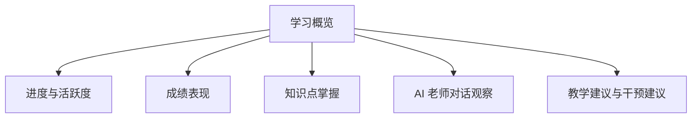
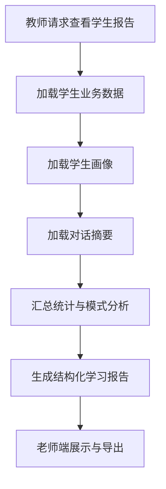

# Student Learning Report Design

## 设计目标

老师端需要能够基于：

- 学生学习进度
- 作业和测验表现
- 错题与薄弱点
- 与老师 Agent 的对话记录
- 个性化画像

自动生成一份：

`学生学习报告`

用于辅助教师了解学生状态、发现问题和进行干预。

## 报告适用场景

- 平时教学跟踪
- 章节学习阶段总结
- 单元测试后反馈
- 实验课程辅导
- 学期中阶段性预警

## 报告来源

报告数据建议来自以下模块：

- 课程进度数据
- 题库与作答记录
- AI 评分结果
- 知识点掌握统计
- 对话历史摘要
- 学生画像

## 报告结构建议

### 1. 基本信息

- 学生姓名 / 学号
- 课程名称
- 当前学习章节
- 最近活跃时间
- 学习总时长

### 2. 学习进度概览

- 章节完成率
- 作业完成率
- 测验参与率
- 最近 7 天活跃情况

### 3. 成绩与表现

- 客观题平均正确率
- 主观题平均得分
- 章节测验趋势
- 最近成绩变化

### 4. 知识点掌握分析

- 已掌握知识点
- 不稳定知识点
- 明显薄弱知识点
- 高频错误类型

### 5. AI 老师观察

这部分来自老师 Agent 的长期观察和摘要：

- 提问活跃度
- 常见疑问方向
- 偏好的解释方式
- 容易卡住的环节
- 是否需要更多引导式教学

### 6. 个性化教学建议

- 建议加强的知识点
- 推荐练习类型
- 推荐解释方式
- 建议教师关注的风险点

## 报告页面结构

## 评分与分析维度

### 定量指标

- 学习时长
- 活跃天数
- 提问次数
- 测验完成率
- 正确率
- 主观题平均分

### 定性指标

- 对话中的理解障碍
- 回答偏好
- 学习节奏特征
- 是否存在畏难或跳步骤现象

## 报告生成流程

## 报告生成方式建议

### 1. 结构化统计

由系统直接算出：

- 章节完成率
- 正确率
- 活跃度
- 错题分布

### 2. AI 摘要生成

由大模型负责生成：

- 学习特征总结
- 对话观察结论
- 教学建议

### 3. 最终合成

将结构化数据与 AI 摘要合并为完整报告。

## 老师端报告示例字段

### 基础概览

- `student_id`
- `course_id`
- `current_chapter`
- `progress_percent`
- `activity_score`

### 学习表现

- `objective_accuracy`
- `subjective_avg_score`
- `assignment_completion_rate`
- `quiz_trend`

### 画像与偏好

- `preferred_explanation_style`
- `preferred_example_style`
- `engagement_level`
- `difficulty_fit`

### 风险与建议

- `weak_points`
- `risk_flags`
- `teacher_suggestions`
- `recommended_next_actions`

## 导出形式建议

老师端建议支持：

- 页面查看
- 导出 PDF
- 导出班级汇总表

## 与个性化 Teacher Agent 的关系

学生学习报告不是独立功能，而是个性化老师 Agent 的管理端输出。

关系如下：

- 学生端对话与学习行为沉淀成画像
- 画像驱动 AI 老师做个性化教学
- 教师端再查看这些沉淀后的报告结果

## 当前阶段建议

第一阶段先生成：

- 学习进度
- 章节掌握情况
- 错题统计
- 对话摘要
- 个性化建议

第二阶段再增加：

- 学习趋势预测
- 风险预警
- 班级横向比较
- 教师干预记录
