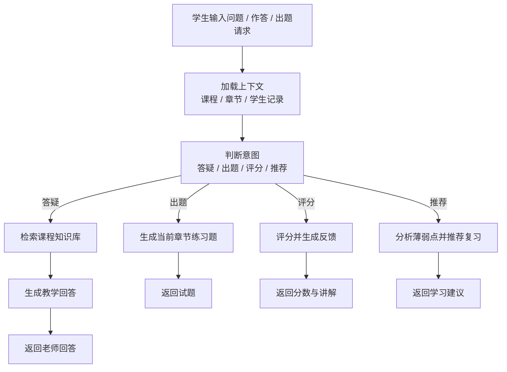

# Teacher Agent Design

## 定位

本项目中的 AI 老师，初步定位为：

`面向单门课程的智能教学 Agent`

它不是普通问答机器人，而是一个围绕课程教学场景工作的智能老师，具备以下能力：

- 基于课程私有知识库回答问题
- 感知当前课程、当前章节、当前学生
- 根据章节内容生成练习题
- 对主观题进行 AI 评分
- 根据学生作答情况给出复习建议

## 为什么做成 Agent

如果只做普通 `RAG 问答`，系统主要只能完成：

- 检索知识
- 回答问题

但教学场景还需要它会做“动作”：

- 判断学生是在提问、求讲解还是求出题
- 自动读取当前章节上下文
- 调用题库和评分工具
- 根据学生历史作答情况推荐下一步学习内容

因此本项目采用：

`RAG + Tools + Agent Workflow`

## 技术路线

当前初步确定：

- `FastAPI`：业务 API 与服务编排入口
- `LangChain`：模型、检索器、工具封装
- `LangGraph`：老师 Agent 的流程与状态编排
- `PostgreSQL`：业务主数据库
- `Qdrant`：课程知识库向量数据库
- `本地文件存储`：课件与附件，后续可切 `MinIO`

## 老师 Agent 的职责边界

### 允许做的事

- 回答课程相关问题
- 根据当前章节解释知识点
- 生成当前章节练习题
- 对学生答案进行评分和反馈
- 推荐复习内容和下一步学习建议

### 不允许做的事

- 脱离课程知识库随意编造答案
- 越权修改成绩
- 在没有证据时给出确定性结论
- 代替教师做最终教务决策

## Agent 工作流

## Agent 状态

建议维护如下状态：

- `student_id`
- `course_id`
- `chapter_id`
- `session_id`
- `intent`
- `retrieved_chunks`
- `quiz_context`
- `grading_context`
- `recommendation_context`
- `response`

这些状态由 `LangGraph` 管理，便于后续做：

- 多轮对话
- 中断恢复
- 教师人工复核
- 学生画像追踪

## 老师 Agent 工具集

### 1. 上下文工具

- `get_student_profile`
- `get_current_course_context`
- `get_current_chapter_context`
- `get_learning_progress`

### 2. 知识检索工具

- `search_course_knowledge`
- `search_by_keyword`
- `search_by_vector`
- `get_chapter_summary`

### 3. 教学工具

- `generate_chapter_quiz`
- `explain_knowledge_point`
- `recommend_review_plan`

### 4. 评分工具

- `score_objective_question`
- `score_subjective_answer`
- `build_feedback_report`

## 老师 Persona

系统提示词建议围绕以下原则设计：

- 你是一名面向本课程的智能教师
- 你必须优先依据课程知识库进行回答
- 你需要结合学生当前章节和学习进度回答
- 你要以教学口吻解释问题，而不是只给结论
- 你要尽量指出知识点、应用场景和常见错误
- 如果证据不足，应明确说明而不是猜测

## 与普通聊天助手的区别

普通聊天助手：

- 主要进行开放问答
- 对教学状态不敏感
- 不天然具备出题和评分能力

老师 Agent：

- 以课程教学为中心
- 感知课程、章节、学生、作答记录
- 能调用教学相关工具
- 能输出讲解、试题、评分、建议四类结果

## 第一阶段实现范围

第一阶段只做可控核心能力：

- 当前章节感知
- 课程知识库问答
- 当前章节随机出题
- 主观题 AI 评分
- 基于错题的复习建议

## 第二阶段扩展方向

- 多轮教学记忆
- 个性化难度调整
- 自动布置练习任务
- 教师审核节点
- 学情分析与学习路径推荐

## 个性化扩展方向

在统一老师 Agent 基础上，后续将增加：

- 基于学生画像的风格适配
- 基于对话历史的个性化解释策略
- 基于作答表现的动态难度调整
- 面向教师端的学生学习报告输出

详细设计见 [docs/personalized-teacher-agent.md](/Users/vermouth/Downloads/edu/docs/personalized-teacher-agent.md) 和 [docs/student-report.md](/Users/vermouth/Downloads/edu/docs/student-report.md)。
